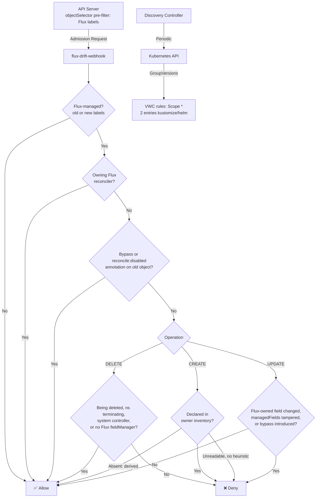

# flux-drift-webhook

[](https://github.com/pmialon/flux-drift-webhook/actions/workflows/ci.yaml)
[](https://goreportcard.com/report/github.com/pmialon/flux-drift-webhook)
[](LICENSE)
[](https://github.com/pmialon/flux-drift-webhook/releases)

A Kubernetes Validating Admission Webhook that prevents manual drift on FluxCD-managed resources using Server-Side Apply (SSA) for field-level protection.

Inspired by [Google Config Sync's drift prevention](https://cloud.google.com/anthos-config-management/docs/how-to/preventing-local-modifications).

## Features

### Core Capabilities

- **Automatic Protection** — Detects Flux-managed resources via labels and prevents unauthorised modifications
- **Field-Level Protection** — Uses Server-Side Apply (SSA) `managedFields` to allow controllers like HPA/VPA/KEDA to modify fields they own
- **Dynamic Discovery** — Automatically discovers all Kubernetes API GroupVersions and updates webhook rules (Scope `*`: cluster-scoped Flux-managed objects — Namespaces, CRDs, ClusterRoles — are protected too; delete a Flux-managed namespace by removing it from Git)
- **Audit Mode** — Log-only mode for testing before enforcement
- **Inheritance-Aware** — Ignores derived objects (e.g. `Endpoints`/`EndpointSlice`/`CertificateRequest`) that merely inherit a parent's Flux labels, so control-plane controllers and the garbage collector are never blocked
- **Bypass Mechanisms** — Annotation-based bypass for emergencies and exceptions

### Protection Rules

| Operation | Resource State | Result |
|-----------|---------------|---------|
| **DELETE** | Flux-applied (Flux SSA fieldManager) | ❌ DENY (unless Flux controller, bypass/`reconcile: disabled` annotation, recognised control-plane controller — GC, Job TTL/CronJob, CRD cleanup — or the parent namespace is terminating). Labels inherited only (no Flux fieldManager) → ✅ ALLOW |
| **UPDATE** | Flux-managed | 🔍 Field-level check against the **old** object (SSA, hierarchy-aware, anti-tampering) |
| **CREATE** | With Flux labels | Owner **inventory is authoritative**: id declared → ❌ DENY for non-Flux actors; id absent → ✅ ALLOW (derived). Unreadable inventory → `ownerReference`/system-controller heuristics, else ❌ fail-closed |

All scopes are covered (`Scope: "*"`): cluster-scoped Flux-managed objects (Namespaces, CRDs, ClusterRoles) are protected too.

### Field-Level Protection (SSA)

The webhook uses Server-Side Apply metadata to determine field ownership:

```yaml
# Example: HPA can update .spec.replicas, Flux manages .spec.template
Flux manages:     spec.template, metadata.labels
HPA manages:      spec.replicas

→ HPA updates spec.replicas        ✅ ALLOWED
→ User updates spec.template       ❌ DENIED
```

Three properties make the check robust against real drift:

- The protected set is read from the **old** object's `managedFields` — the API
  server transfers field ownership to the requester *before* validating
  admission runs, so the new object no longer attributes drifted fields to Flux.
- The overlap test is **hierarchy-aware**: editing an entry inside a keyed list
  Flux owns (e.g. `kubectl set image` touching `containers[name="app"]`) is a
  conflict even though the value diff records the list path as a whole.
  Conservatively, any change inside a keyed list Flux partially owns is denied
  (the bypass annotation is the escape hatch).
- Releasing Flux field ownership **without a value change** (wiping
  `metadata.managedFields`, or server-side-applying a reduced config under the
  `kustomize-`/`helm-controller` manager name) is denied
  (`denied_managed_fields_tampered`), as it would disarm the check for every
  later request. Stripping the Flux labels together with the drift in a single
  request is likewise caught — the management gate also evaluates the old
  object's labels.
- Fields the owning Kustomization excludes from drift detection via `.spec.ignore`
  (Flux v2.9 DriftIgnoreRules) are **waived** (`allowed_drift_ignored_field`): Flux
  neither corrects nor reapplies them, so a manual edit is allowed. See
  [2c. Ignored Fields](#2c-ignored-fields-specignore).

## Architecture



### Components

- **Webhook Handler** — Processes admission requests and enforces protection rules
- **Discovery Controller** — Periodically queries Kubernetes API and updates the ValidatingWebhookConfiguration: two webhook entries (`kustomize.`/`helm.` prefixed), each pre-filtering at the API server with an `objectSelector` requiring the corresponding Flux ownership label (`Exists`) — unlabelled objects never round-trip the webhook
- **Metrics Exporter** — Exposes Prometheus metrics for observability

## Prerequisites

- Kubernetes 1.25+
- FluxCD installed in cluster (any version supporting SSA)
- cert-manager for TLS certificate management
- Kustomize 5.4+ for deployment
- Go 1.26.0+ to build from source

### Key Dependencies

| Dependency | Version |
|------------|---------|
| `sigs.k8s.io/controller-runtime` | `v0.24.1` |
| `k8s.io/{api,apimachinery,client-go}` | `v0.36.2` |
| `sigs.k8s.io/structured-merge-diff/v6` | `v6.4.0` |
| `github.com/fluxcd/pkg/runtime` | `v0.110.1` |
| `github.com/spf13/pflag` | `v1.0.10` |

## Quick Start

### Installation

1. **Clone the repository**

```bash
git clone https://github.com/pmialon/flux-drift-webhook.git
cd flux-drift-webhook
```

2. **Build the Docker image**

```bash
make docker-build IMG=<your-registry>/flux-drift-webhook:latest
make docker-push IMG=<your-registry>/flux-drift-webhook:latest
```

3. **Deploy to Kubernetes**

```bash
# Dev environment (audit-only mode)
make deploy-dev

# Production environment (enforce mode)
make deploy-prod
```

### Deploy via Helm (alternative)

A Helm chart is published as an OCI artefact as an alternative to the Kustomize manifests above
(pick one — both render the same resources). Install it into the Flux namespace:

```bash
helm install flux-drift-webhook \
  oci://ghcr.io/pmialon/charts/flux-drift-webhook \
  --version <x.y.z> \
  --namespace flux-system --create-namespace

# Audit-only mode
helm install flux-drift-webhook oci://… -n flux-system --set config.auditOnly=true
```

The chart lives in [`charts/flux-drift-webhook/`](charts/flux-drift-webhook) — see its
[README](charts/flux-drift-webhook/README.md) for the full values reference. It requires cert-manager
(or a bring-your-own CA) and must run in the Flux namespace (the webhook Service name is pinned to the
controller's expectation).

### Verification

```bash
# Check webhook is running
kubectl get pods -n flux-system -l app.kubernetes.io/name=flux-drift-webhook

# View logs
kubectl logs -n flux-system -l app.kubernetes.io/name=flux-drift-webhook

# Check metrics
kubectl port-forward -n flux-system svc/flux-drift-webhook 8080:8080
curl http://localhost:8080/metrics
```

## Configuration

### CLI Flags

| Flag | Default | Description |
|------|---------|-------------|
| `--webhook-port` | `9443` | Webhook server port |
| `--metrics-bind-addr` | `:8080` | Metrics endpoint address (also serves pprof) |
| `--health-probe-bind-addr` | `:8081` | Health probe address |
| `--cert-dir` | `/certs` | TLS certificates directory |
| `--audit-only` | `false` | Audit-only mode (log without blocking) |
| `--log-level` | `info` | Log verbosity level (`trace`, `debug`, `info`, `error`) |
| `--log-encoding` | `json` | Log encoding format (`json`, `console`) |
| `--flux-namespace` | `flux-system` | FluxCD namespace |
| `--webhook-name` | `flux-drift-webhook.fluxcd.io` | ValidatingWebhookConfiguration name |
| `--discovery-interval` | `5m` | GVK discovery interval |
| `--namespace-label` | *(empty)* | Optional: namespace label key to filter webhook scope |
| `--namespace-label-value` | *(empty)* | Optional: required namespace label value (needs `--namespace-label`) |
| `--namespace-fetch-timeout` | `2s` | Timeout for namespace label lookups |
| `--system-controller-sas` | *(empty)* | Extra control-plane identities (CSV of `namespace:name` SA shorthands or full `system:` usernames) allowed to CREATE Flux-labelled derived resources and DELETE Flux-applied resources; merged with built-in defaults |
| `--enable-leader-election` | `false` | Enable leader election (the deploy overlays set this `true`) |
| `--leader-election-lease-duration` | `35s` | Interval non-leader candidates wait before force-acquiring leadership |
| `--leader-election-renew-deadline` | `30s` | Duration the leader retries refreshing leadership before giving up |
| `--leader-election-retry-period` | `5s` | Duration clients wait between leader-election attempts |
| `--leader-election-release-on-cancel` | `true` | Whether the leader steps down voluntarily on shutdown |
| `--kube-api-qps` | `50` | Maximum queries-per-second of requests to the Kubernetes API |
| `--kube-api-burst` | `300` | Maximum burst queries-per-second of requests to the Kubernetes API |

The manager is built on [`github.com/fluxcd/pkg/runtime`](https://github.com/fluxcd/pkg/runtime)
option structs (logger, leader election, pprof, probes, events) with `spf13/pflag`. Leader
election is opt-in (only the leader performs GVK discovery and updates the VWC); pprof is served
on the metrics port; Kubernetes Events are emitted on the VWC controller.

### Environment Variables

Override defaults via environment variables:

- `FLUX_NAMESPACE` — Override Flux namespace
- `WEBHOOK_NAME` — Override ValidatingWebhookConfiguration name
- `DISCOVERY_INTERVAL` — Override discovery interval
- `SYSTEM_CONTROLLER_SAS` — Extra control-plane SAs (CSV of `namespace:name`) for derived-resource CREATE bypass

### Bypass Mechanisms

#### 1. Flux Controllers (Automatic)

Requests from Flux controllers are always allowed:
- `kustomize-controller`
- `helm-controller`
- `source-controller`
- `notification-controller`
- `image-reflector-controller`
- `image-automation-controller`

#### 2. Bypass Annotation

Add the annotation **via Git** to resources that need manual intervention — Flux
applies it on the next reconcile, after which manual changes are allowed. A
non-Flux UPDATE that introduces the annotation directly on a Flux-applied
object is denied (`denied_bypass_annotation_added`): otherwise adding it would
never conflict with the Flux field set, and the *next* request would be waved
through (two-step bypass).

```yaml
apiVersion: apps/v1
kind: Deployment
metadata:
  name: my-app
  annotations:
    fluxcd.io/drift-prevention-bypass: disabled
  labels:
    kustomize.toolkit.fluxcd.io/name: my-app
    kustomize.toolkit.fluxcd.io/namespace: flux-system
```

#### 2b. Reconcile Disabled (abandonment)

`kustomize.toolkit.fluxcd.io/reconcile: disabled` on the existing object is
honoured as a bypass (`allowed_reconcile_disabled`): kustomize-controller skips
such objects entirely, so drift prevention on them would be incoherent. To
un-manage a resource without deleting it, apply that annotation (plus
`kustomize.toolkit.fluxcd.io/prune: disabled` if you will remove it from Git)
**via Git**, wait for Flux to reconcile, then manage it freely. Introducing the
annotation directly is denied like the bypass annotation; HelmRelease-owned
objects are unaffected (helm-controller has no per-object equivalent).

#### 2c. Ignored Fields (`.spec.ignore`)

When the owning **Kustomization** excludes fields from drift detection with
`.spec.ignore` (Flux v2.9 [DriftIgnoreRules](https://fluxcd.io/flux/components/kustomize/kustomizations/#drift-detection)),
the webhook waives an UPDATE whose conflicting fields are all covered
(`allowed_drift_ignored_field`) — Flux would not correct those fields, so blocking
a manual edit would be incoherent (the same rationale as `reconcile: disabled`).

```yaml
# Kustomization owning the Deployment
spec:
  ignore:
    - paths: ["/spec/replicas"]        # let an HPA/operator own replicas
      target:                          # optional; omit to match all owned objects
        kind: Deployment
        labelSelector: "app=web"
```

Each rule's `paths` are RFC 6901 JSON pointers; the optional `target` Selector
(`group`/`version`/`kind`/`name`/`namespace` as anchored regexes, plus
`labelSelector`/`annotationSelector`) is matched against the object, mirroring
Flux's own selector semantics. The owning Kustomization is read from the cache
only when an edit would otherwise be denied — **no new RBAC** (the existing
get/list/watch on `kustomizations` suffices). Fail-closed: an unreadable owner or
a malformed matching rule waives nothing.

**Limitation:** the value diff is schema-blind and records a keyed-list/array edit
as the whole list path, so an ignore pointer that descends into an array index or
keyed-list member (e.g. `/spec/template/spec/containers/0/image`) does **not**
waive — use a pointer at or above the list path (`/spec/template/spec/containers`).
HelmRelease has no `.spec.ignore`, so HelmRelease-owned objects are unaffected.

#### 3. Resource Being Deleted

Resources with their own `deletionTimestamp` are allowed (already in deletion
process — `allowed_deletion_in_progress`).

A DELETE is also allowed when the resource's **parent namespace is terminating**
(`allowed_namespace_terminating`). During namespace teardown the kube
`namespace-controller` issues a direct DELETE on every finalizer-free child, so
the child never gets its own `deletionTimestamp`; blocking these cannot prevent
drift (the namespace is already gone) and would only wedge the namespace in
`Terminating`. The signal is the parent namespace's `deletionTimestamp`, which a
single manual child DELETE cannot fabricate — live-namespace protection is
unchanged. Fail-closed if the namespace cannot be read.

#### 4. Derived / Inherited-Label Resources

The webhook treats a resource as Flux-managed only when Flux actually applied it,
proven by a Flux `fieldManager` in `.metadata.managedFields` — **not** by the mere
presence of a Flux label, which Kubernetes copies onto derived child objects.

- **DELETE / UPDATE**: a resource carrying Flux labels but no Flux `fieldManager`
  (e.g. an `Endpoints`/`EndpointSlice` that inherited its parent `Service`'s labels)
  is allowed (`allowed_no_flux_managed_fields`).
- **CREATE**: `managedFields` are not yet populated. The owning
  Kustomization/HelmRelease `.status.inventory` is consulted **first** and is
  authoritative when readable: an id (`<namespace>_<name>_<group>_<kind>`) that
  **is** declared in it is denied for every non-Flux actor — **regardless of any
  `ownerReference` or requester identity**, since the API server does not
  validate `ownerReferences` on CREATE and a forged controller reference must
  not enable squatting. An id that is **absent** identifies a derived object
  (e.g. an operator-generated `VMServiceScrape` from a Flux-applied
  `ServiceMonitor`) and is allowed (`allowed_not_in_owner_inventory`). Two
  heuristics cover the cases the inventory cannot:
  - a **controller `ownerReference`** (`allowed_owned_resource`) — covers
    `EndpointSlice`→`Service`, `CertificateRequest`→`Certificate`, and any operator's
    owned children, including cert-manager (outside `kube-system`);
  - a **recognised control-plane controller** (`allowed_system_controller`) — covers
    classic `Endpoints`, which carry no `ownerReference`. Configurable via
    `--system-controller-sas` / `SYSTEM_CONTROLLER_SAS` (CSV of `namespace:name`
    SA shorthands or full `system:` usernames — the defaults include
    `system:apiserver` for CRD-finalizer cleanup and `system:kube-controller-manager`
    for KCM without `--use-service-account-credentials`).

  When the inventory cannot be read and neither heuristic matches, the CREATE
  fails closed with the distinct reason `denied_create_inventory_unavailable`,
  so owner/cache trouble is distinguishable from genuine squats.

```yaml
# An EndpointSlice created by the endpointslice-controller inherits the Service's
# Flux label and is owned by the Service — it is NOT directly Flux-managed:
apiVersion: discovery.k8s.io/v1
kind: EndpointSlice
metadata:
  name: my-app-xyz
  labels:
    kustomize.toolkit.fluxcd.io/name: my-app          # inherited from the Service
    endpointslice.kubernetes.io/managed-by: endpointslice-controller.k8s.io
  ownerReferences:
    - apiVersion: v1
      kind: Service
      name: my-app
      controller: true                                 # → allowed_owned_resource
```

#### 5. Sub-resources

Requests for a sub-resource (`status`, `scale`, …) are allowed
(`allowed_subresource`) — they do not carry the parent object needed for drift
evaluation.

## Monitoring

### Prometheus Metrics

The webhook exposes metrics on `:8080/metrics`:

| Metric | Type | Description |
|--------|------|-------------|
| `flux_drift_webhook_requests_total` | Counter | Total admission requests by operation and decision |
| `flux_drift_webhook_denials_total` | Counter | Total denied requests by operation and kind |
| `flux_drift_webhook_ownership_conflicts_total` | Counter | Dual/multiple ownership conflicts by kind and the conflicting Flux owners (`previous_owner`/`new_owner`) |
| `flux_drift_webhook_latency_seconds` | Histogram | Request processing latency |
| `flux_drift_webhook_discovery_errors_total` | Counter | GVK discovery errors |
| `flux_drift_webhook_config_updates_total` | Counter | ValidatingWebhookConfiguration updates |

### Example Prometheus Queries

```promql
# Request rate by decision
rate(flux_drift_webhook_requests_total[5m])

# Denial rate
rate(flux_drift_webhook_denials_total[5m])

# Dual/multiple ownership: which Flux owners are fighting, by resource kind
sum by (kind, previous_owner, new_owner) (
  increase(flux_drift_webhook_ownership_conflicts_total[1h])
)

# P95 latency
histogram_quantile(0.95, rate(flux_drift_webhook_latency_seconds_bucket[5m]))
```

### Health Endpoints

- `/healthz` — Liveness probe
- `/readyz` — Readiness probe

## Development

### Project Structure

```
flux-drift-webhook/
├── cmd/webhook/              # Main entry point
├── internal/
│   ├── config/              # Configuration constants
│   ├── controller/          # Webhook config controller
│   ├── discovery/           # GVK discovery
│   ├── metrics/             # Prometheus metrics
│   └── webhook/             # Core webhook logic
│       ├── handler.go       # Admission handler
│       ├── fields.go        # SSA field protection
│       ├── auth.go          # Authentication
│       └── labels.go        # Label detection
├── deploy/
│   ├── base/                # Kustomize base
│   └── overlays/            # Environment overlays
│       ├── dev/             # Audit-only mode
│       └── prod/            # Enforce mode
└── e2e/                     # E2E tests
```

### Building from Source

```bash
# Install dependencies
go mod download

# Build binary
make build

# Run tests
make test

# Run linter
make lint

# Verify everything (fmt, vet, tidy, generate, lint, structure, build, test,
# kubeconform manifests, and a clean-tree check)
make verify

# Full local CI (verify + docker build + envtest integration + fuzz smoke test)
make ci
```

### Running Tests

The suite has three tiers:

1. **CGO-free stdlib unit tests** (`make test`) — run on any host; also exercises the fuzz
   seed corpora. `make test-race` adds the race detector (requires CGO).
2. **Envtest integration suite** (`make test-integration`) — Go tests behind the
   `//go:build integration` tag that run against a real kube-apiserver via
   `fluxcd/pkg/runtime` testenv.
3. **Native Go fuzz targets** (`make fuzz-smoketest`) — short fuzzing smoke run over the
   fuzz targets.

```bash
# Unit tests (CGO-free; runs the fuzz seed corpora)
make test-unit

# Unit tests with the race detector (requires CGO)
make test-race

# Integration tests (envtest — real apiserver via setup-envtest)
make test-integration

# Fuzz smoke test
make fuzz-smoketest

# E2E tests (requires kind)
make test-e2e

# Coverage report
make coverage
```

> **Note:** the envtest kube-apiserver/etcd assets are fetched from an external GitHub index (not
> the module proxy), so `make test-integration` needs network access or pre-seeded assets.
> GitHub-hosted CI runners have that access, so it runs as an automatic gate.

### Local Development

```bash
# Run webhook locally (requires kubeconfig)
go run ./cmd/webhook --audit-only=true --log-encoding=console

# Build and load into kind cluster
kind create cluster --name webhook-dev
make docker-build IMG=flux-drift-webhook:dev
kind load docker-image flux-drift-webhook:dev --name webhook-dev
make deploy-dev
```

### CI Pipeline

The GitHub Actions CI workflow (`.github/workflows/ci.yaml`) runs the following gates on every pull
request and push to `main`:

- `lint` — `golangci-lint` (gosec runs as a configured linter)
- `test` — `go vet`, `gofmt` check, and unit tests with `-race` plus coverage
- `verify-codegen` — confirms `go mod tidy`/`go generate` leave the tree clean
- `fuzz` — short run of the native Go fuzz targets
- `integration` — envtest integration suite
- `manifests` — `kubeconform` validation of the Kustomize overlays
- `helm` — `helm lint` plus `helm template | kubeconform`
- `build` — multi-arch container image build (no push)

Releases are cut by `.github/workflows/release.yaml` on `v*` tags: a multi-arch image to
`ghcr.io/pmialon/flux-drift-webhook` (cosign keyless signature, SBOM, SLSA provenance), the Helm
chart published as an OCI artefact, and a GitHub release with checksums.

## Troubleshooting

<details>
<summary>Webhook denies legitimate controller updates (HPA, VPA, KEDA)</summary>

**Cause**: The controller's `managedFields` may not be correctly registered.

**Solution**:
1. Check if the controller uses Server-Side Apply (SSA)
2. Verify `managedFields` in the resource:
   ```bash
   kubectl get deployment <name> -n <namespace> -o yaml | grep -A 20 managedFields
   ```
3. If SSA is not used, consider adding the controller to the allowlist (future improvement)
</details>

<details>
<summary>ValidatingWebhookConfiguration rules are empty</summary>

**Cause**: Discovery controller may not have run yet or encountered errors.

**Solution**:
1. Check webhook logs:
   ```bash
   kubectl logs -n flux-system -l app.kubernetes.io/name=flux-drift-webhook
   ```
2. Verify RBAC permissions for API discovery
3. Manually trigger reconciliation by restarting the pod
</details>

<details>
<summary>Webhook denies all requests with timeout</summary>

**Cause**: Certificate issues or webhook service unreachable.

**Solution**:
1. Check cert-manager Certificate status:
   ```bash
   kubectl get certificate -n flux-system flux-drift-webhook
   ```
2. Verify webhook Service and Endpoints:
   ```bash
   kubectl get svc,endpoints -n flux-system flux-drift-webhook
   ```
3. Check webhook pod status and logs
</details>

<details>
<summary>How to temporarily disable the webhook</summary>

**Solution**:
```bash
# Delete the ValidatingWebhookConfiguration
kubectl delete validatingwebhookconfiguration flux-drift-webhook.fluxcd.io

# Or scale down the deployment
kubectl scale deployment flux-drift-webhook -n flux-system --replicas=0
```
</details>

## Roadmap

### v1.0 (Current)

- [x] Core drift prevention logic
- [x] Field-level protection using SSA
- [x] Dynamic GVK discovery
- [x] Prometheus metrics
- [x] Audit mode
- [x] Bypass annotation

### Future Improvements

Planned enhancements:

- **Whitelist of System Service Accounts** — Allow specific controllers without SSA dependency
- **Per-Resource Field Exclusion** — Annotation-based field exclusion for fine-grained control
- **Custom Resource Definition (CRD) Support** — Better handling of CRDs
- **Webhook Configuration Policies** — Declarative configuration via CRDs

## Contributing

Contributions are welcome! Please read the following before contributing:

1. **Code Style** — Follow conventions in [CLAUDE.md](CLAUDE.md)
2. **Testing** — All new features must include unit tests
3. **Documentation** — Update README and relevant docs
4. **Commit Messages** — Use [Conventional Commits](https://www.conventionalcommits.org/) (`type(scope): subject`)

### Development Workflow

```bash
# Create feature branch
git checkout -b feat/my-feature

# Make changes and test
make verify
make test

# Commit with a signed-off semantic message (see CONTRIBUTING.md)
git commit -s -m "feat(handler): add support for custom annotations"

# Push and open a pull request
git push origin feat/my-feature
```

## Documentation

- [DEVELOPMENT.md](DEVELOPMENT.md) — Local build, test and deploy workflow
- [CONTRIBUTING.md](CONTRIBUTING.md) — Contribution guidelines, DCO sign-off and commit conventions
- [CLAUDE.md](CLAUDE.md) — Architecture, configuration and conventions

## Related Projects

- [FluxCD](https://fluxcd.io/) — GitOps toolkit for Kubernetes
- [Google Config Sync](https://cloud.google.com/anthos-config-management/docs/config-sync-overview) — Inspiration for drift prevention
- [Kyverno](https://kyverno.io/) — Policy engine for Kubernetes
- [OPA Gatekeeper](https://open-policy-agent.github.io/gatekeeper/) — Policy controller

## License

Apache License 2.0 - see [LICENSE](LICENSE) for details.

## Support

- **Issues** — Report bugs or request features via [GitHub Issues](https://github.com/pmialon/flux-drift-webhook/issues)
- **Discussions** — Ask questions via [GitHub Discussions](https://github.com/pmialon/flux-drift-webhook/discussions)
- **Security** — Report vulnerabilities privately per [SECURITY.md](SECURITY.md)

<hr>

**Made with ❤️ for the FluxCD community**
